# Android on Kotlin@geekbrains (https://gb.ru/go/aPWYkD)
## Lesson2: MVVM, live data
new app: Movies
### Preview
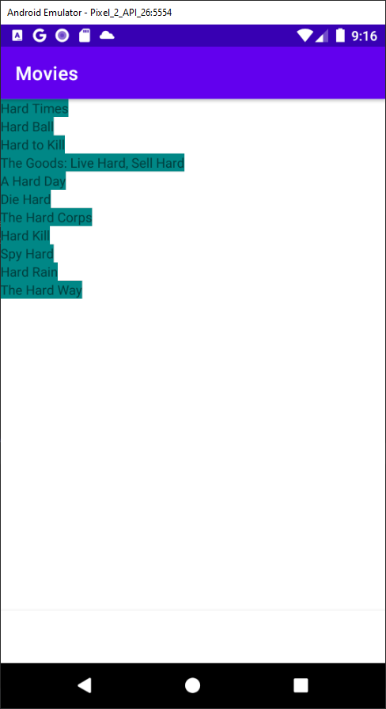

## Lesson3: MVVM
app changes: CustomView with list of movies (2 such views: movies and series),
movie-details screen,
bottom view navigation,
favorites
### Preview
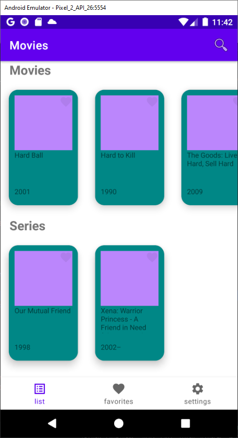
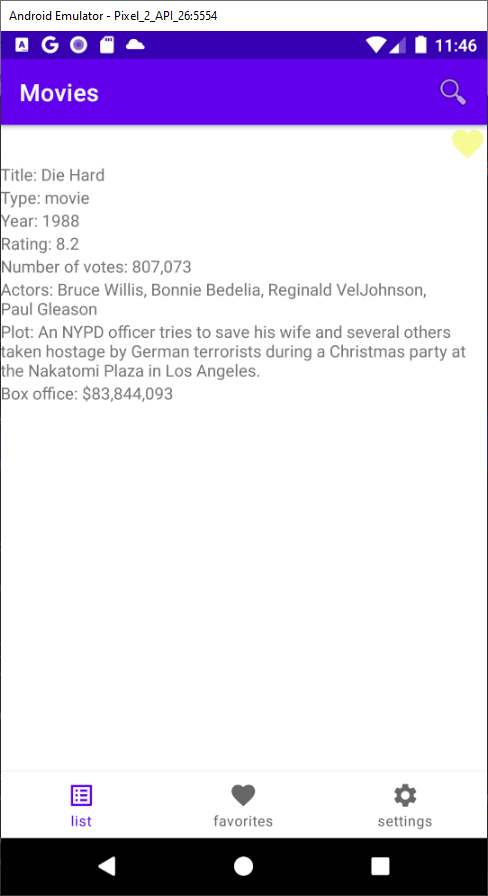

## Lesson4: Kotlin functions
app changes: settings screen: choose group by field,
dynamic lists, searching, rebuilding details screen
### Preview
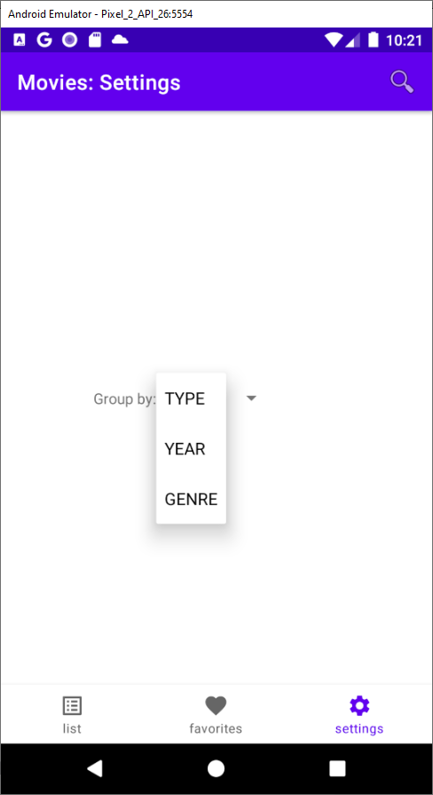
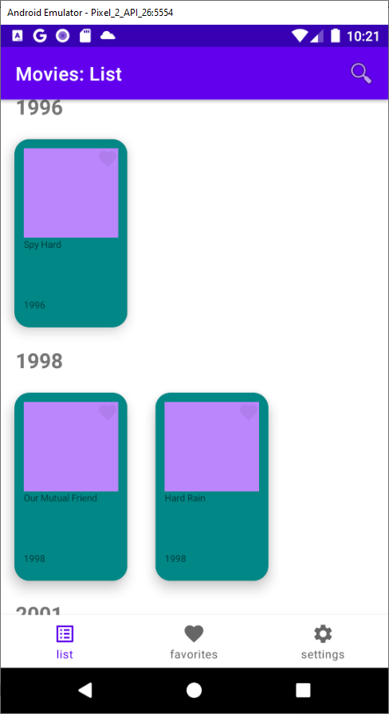
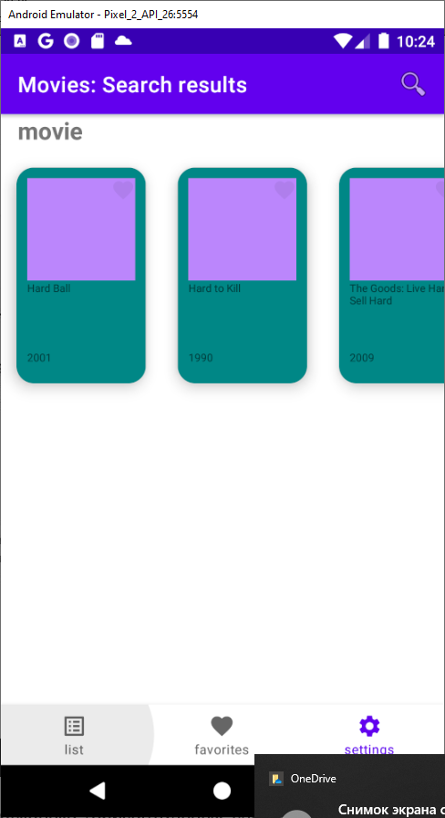
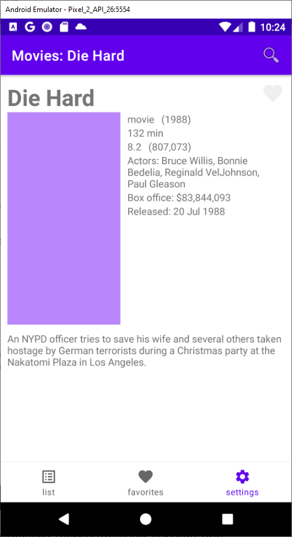

## Lesson5: Internet access
app changes: request data from https://www.themoviedb.org: trending, details, search, genres
'manual' parsing of json-files with JSONObject
groupBy list-field: split list into separate values 
connection-error handling
### Preview
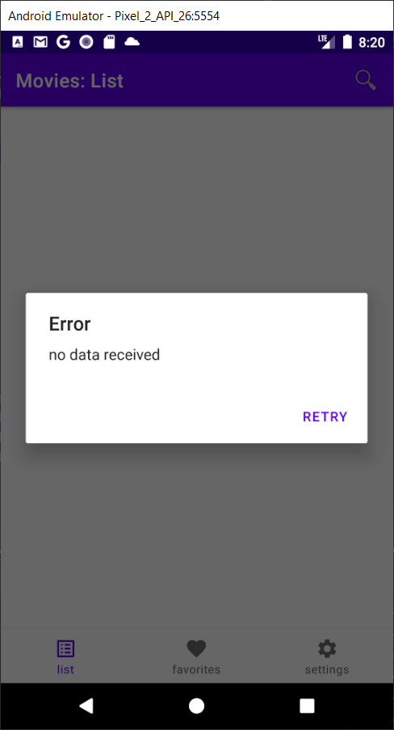
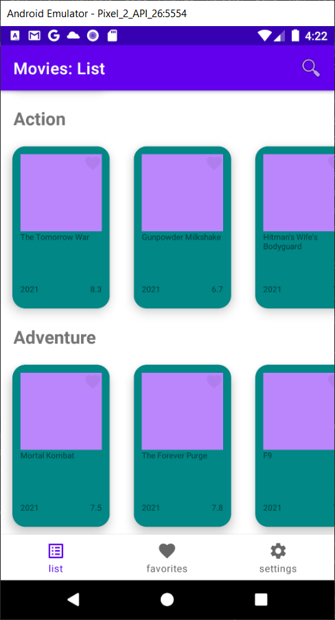

## Lesson5+: Internet access
app changes: lists of movies; my status bar
### Preview
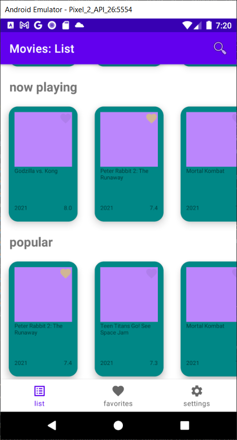
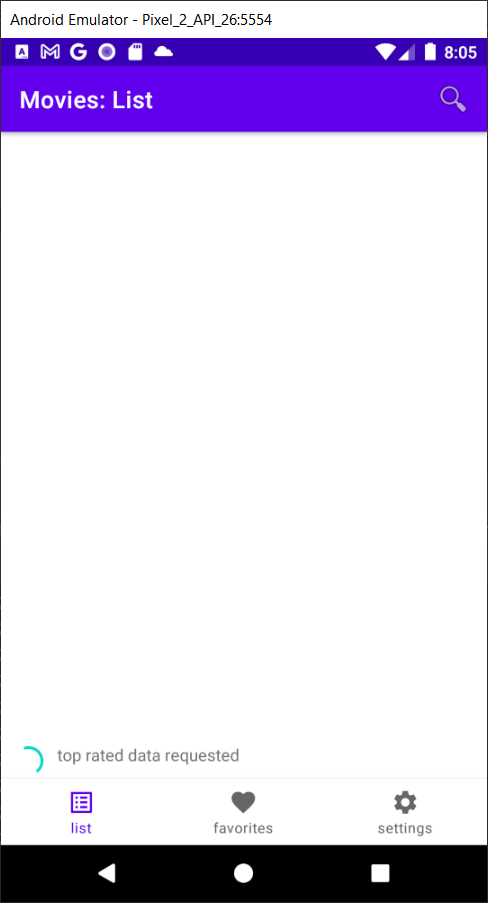

## Lesson6: Concurrency: Looper, Handler; Services
app changes: HandlerThread processing all requests; Service (for future background requests); fixed bug: retain lists state
### Preview
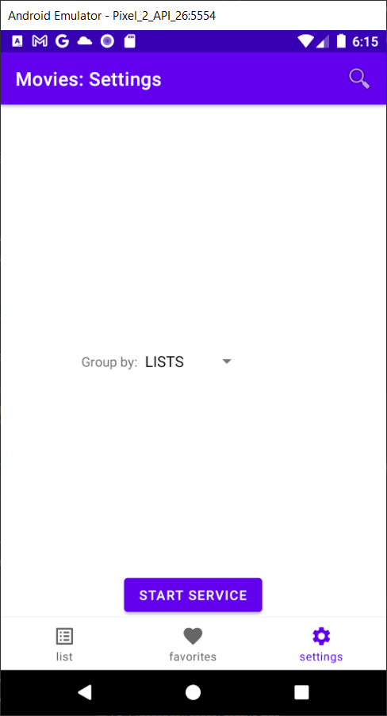

## Lesson6+: 
app changes: sort list; search result navigatio
### Preview
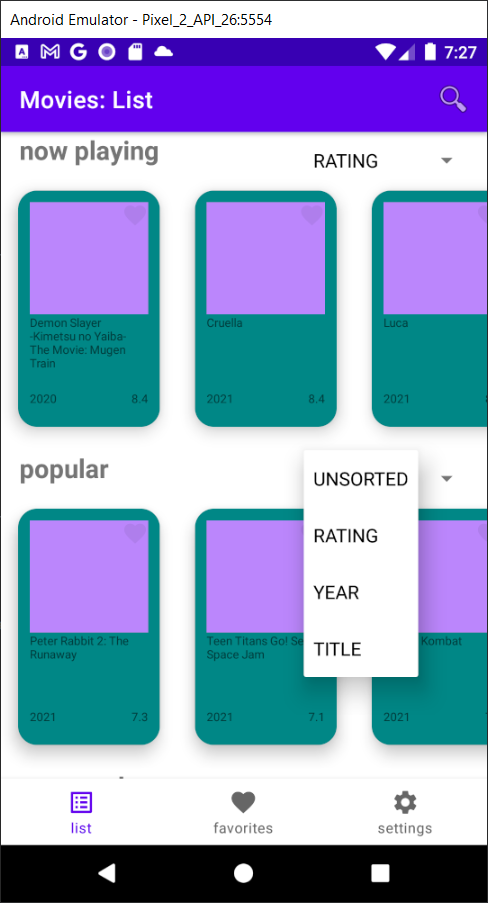
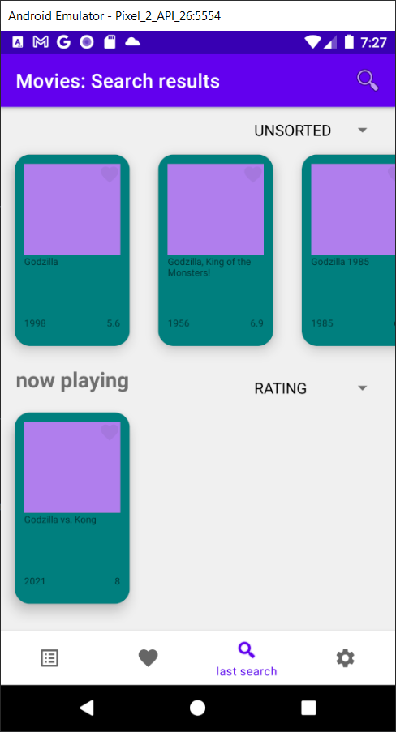

## Lesson7: Retrofit and Glide 
app changes: replaced dataProvider with retrofit; image loading with Glide
### Preview
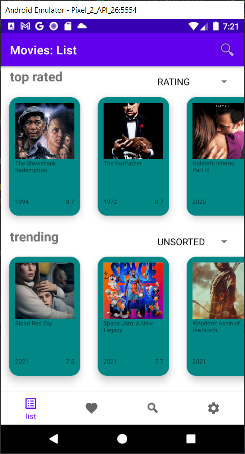
(../apks/app-debug-7.apk "movies.apk from lesson7")

